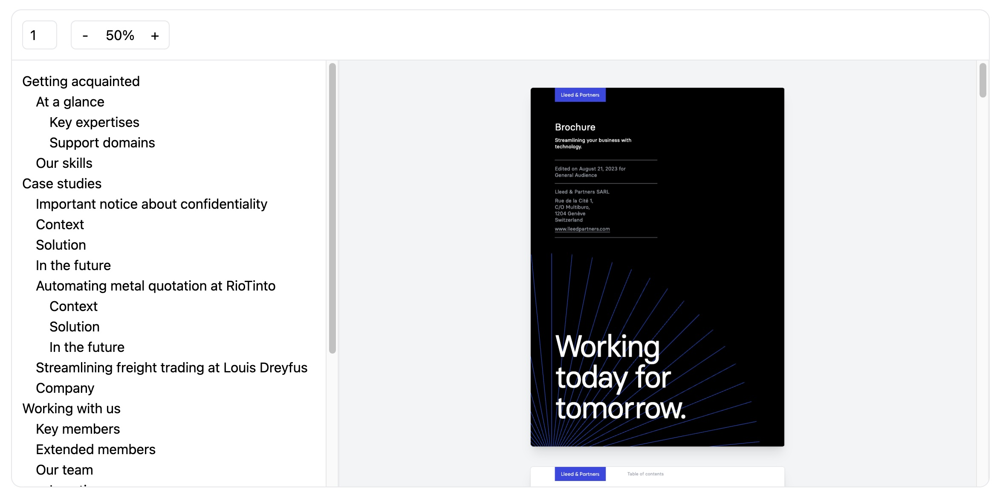

# PDFReader

A dead simple, stylable, React PDF reader component.

> Important: This component is still in development and not ready for production use.

## Features

- [x] Zoom in and out
- [x] Text layer
- [x] Annotation layer
- [x] Canvas layer
- [x] Page navigation
- [x] Outline view
- [x] Thumbnail view
- [ ] Two-sided view
- [ ] Search and highlight
- [ ] Annotation placement

## Installation

```bash
npm i @fileforge/pdfreader
```

## Usage

You can add and remove parts of the reader by adding or removing the related components. NB: the `Viewport` component always needs to have `Pages` and `Page` as direct children.



```jsx
import React from 'react';

import { Root, CurrentPage, ZoomOut, Zoom, ZoomIn, Outline, OutlineItem, OutlineChildItems, Viewport, Pages, Page, CanvasLayer, TextLayer, AnnotationLayer } from '@fileforge/pdfreader';

export const Reader = ({ fileURL }: { fileURL: string }) => {
  return (
    <Root fileURL={fileURL} className="m-4 border rounded-xl overflow-hidden">
      <div className="border-b p-3 flex gap-4">
        <CurrentPage className="border bg-white rounded-md text-center py-1" />
        <div className="flex border rounded-md">
          <ZoomOut className="aspect-square block h-8 w-8">-</ZoomOut>
          <Zoom className="py-1 px-2 bg-white" />
          <ZoomIn className="aspect-square block h-8 w-8">+</ZoomIn>
        </div>
      </div>
      <div className="grid grid-cols-[24rem,1fr] h-[500px] overflow-hidden">
        <Outline className="border-r overflow-auto p-3">
          <OutlineItem className="block">
            <OutlineChildItems className="pl-4" />
          </OutlineItem>
        </Outline>
        <Viewport className="bg-gray-100 py-4">
          <Pages>
            <Page className="shadow-xl m-8 my-4 first:mt-8 outline outline-black/5 rounded-md overflow-hidden">
              <CanvasLayer />
              <TextLayer />
              <AnnotationLayer />
            </Page>
          </Pages>
        </Viewport>
      </div>
    </Root>
  );
};
```

## Sponsors

This project is sponsored by [Fileforge](https://fileforge.com).
